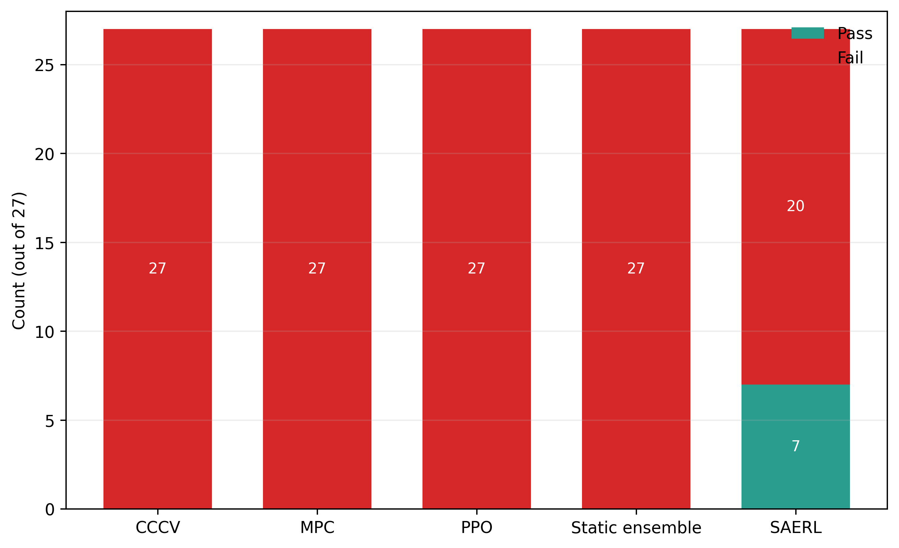
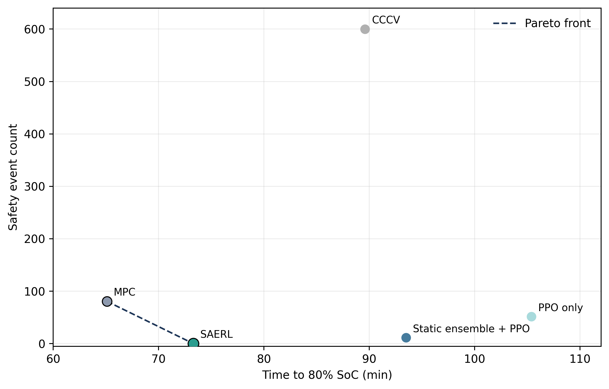
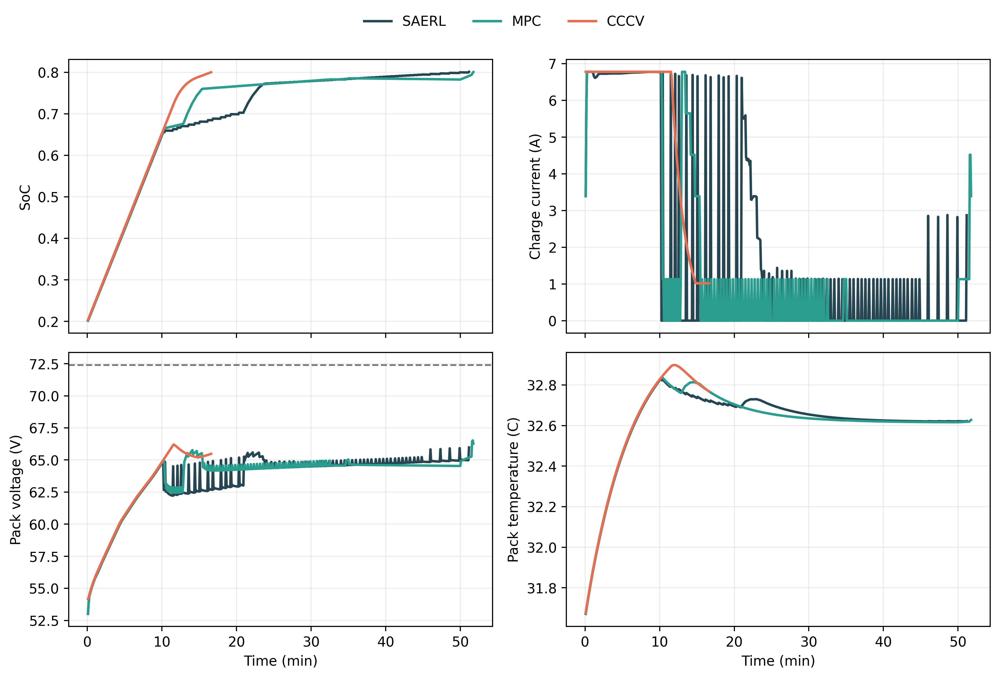

# SAERL for Safe Fast Charging of Lithium-Ion Battery Packs

This repository implements Safe Adaptive Ensemble Reinforcement Learning (SAERL), a hybrid battery-charging framework that combines physics-based modeling, uncertainty-aware ensemble prediction, residual reinforcement learning, and hard safety shielding for pack-level lithium-ion fast charging. The codebase includes the battery and pack simulators, data-calibrated baselines, SAERL dataset generation and training pipelines, evaluation and aggregation scripts, and the paper assets used to report benchmark results.

## Latest Benchmark Snapshot

The latest full benchmark uses 27 scenarios spanning three public dataset families (`NASA`, `CALCE`, `MATR`) and three charging objectives (`fastest`, `safe`, `long_life`).

| Metric | Latest result |
| --- | --- |
| Overall acceptance | `7/27` (`25.9%`) |
| Safety criterion pass rate | `100%` |
| Temperature criterion pass rate | `100%` |
| Q-loss criterion pass rate | `88.9%` |
| Performance criterion pass rate | `37.0%` |
| Mean SAERL time to 80% SoC | `73.3 min` |
| Mean SAERL inference latency | `28.7 ms` |
| Best family | `MATR` (`4/9`) |
| Weakest family | `NASA` (`0/9`) |







## What Is In This Repository

- `physics_model.py`: electro-thermal-aging cell model used by the simulators and controllers.
- `battery_pack_model.py`: pack-level composition with cell variation, balancing, and thermal interaction.
- `hambrl_pack_env.py`: Gym-like pack charging environment.
- `parameter_identification.py`: parameter fitting and calibration utilities for standardized datasets.
- `controllers/adaptive_ensemble_rl.py`: SAERL ensemble experts, gate, residual actor, and inference logic.
- `controllers/residual_hambrl.py`: earlier residual H-AMBRL controller components.
- `scripts/generate_saerl_dataset.py`: mixed-behavior SAERL dataset generation.
- `scripts/train_saerl_ensemble.py`: ensemble expert and gate training.
- `scripts/train_saerl_policy.py`: residual actor offline and online training.
- `scripts/eval_saerl_vs_baselines.py`: held-out benchmark evaluation.
- `scripts/aggregate_saerl_results.py`: aggregate summaries and diagnostics.
- `scripts/run_saerl_phase3h_source_context_v1.py`: end-to-end source-aware benchmark runner.
- `paper/`: manuscript, figure assets, and figure-generation utilities.

## Data

Raw datasets are not committed to the repository. Only the source reference file is tracked:

- [data/DATASET_SOURCES.md](data/DATASET_SOURCES.md)

The benchmark pipeline assumes you have local copies of the standardized and calibrated dataset files needed by the scripts under `data/`.

## Main Workflows

### 1. Run data-calibrated baselines

```bash
python scripts/run_baseline_benchmarks.py --use-real-data --dataset-families nasa,calce,matr --max-files-per-dataset 1 --objective all --max-steps 1200
```

### 2. Run the full source-aware SAERL benchmark

This is the main end-to-end runner for the current benchmark branch:

```bash
python scripts/run_saerl_phase3h_source_context_v1.py
```

It generates:

- source-aware SAERL datasets
- ensemble checkpoints
- residual policy checkpoints
- held-out evaluation outputs
- aggregate benchmark summaries

### 3. Run the source-aware pipeline step by step

Generate the dataset:

```bash
python scripts/generate_saerl_dataset.py --objective all --dataset-families nasa,calce,matr --context-feature-set source_v1 --family-metadata-json configs/source_family_metadata_v1.json
```

Train the ensemble:

```bash
python scripts/train_saerl_ensemble.py --dataset-csv data/training/saerl_phase3h_source_context_v1_dataset.csv --split-manifest-json data/training/saerl_phase3h_source_context_v1_splits.json --context-feature-set source_v1
```

Train the policy:

```bash
python scripts/train_saerl_policy.py --dataset-csv data/training/saerl_phase3h_source_context_v1_dataset.csv --split-manifest-json data/training/saerl_phase3h_source_context_v1_splits.json --context-feature-set source_v1 --saerl-mpc-anchor-mode family_specific
```

Evaluate:

```bash
python scripts/eval_saerl_vs_baselines.py --dataset-csv data/training/saerl_phase3h_source_context_v1_dataset.csv --split-manifest-json data/training/saerl_phase3h_source_context_v1_splits.json --context-feature-set source_v1
```

Aggregate:

```bash
python scripts/aggregate_saerl_results.py --input-root results/saerl_phase3h_source_context_v1/evaluation_allfolds_3family --output-root results/saerl_phase3h_source_context_v1/aggregate_allfolds_3family
```

## Paper and Figures

The manuscript lives in:

- [paper/main.tex](paper/main.tex)

Regenerate the results-section figures with:

```bash
python scripts/generate_results_section_figures.py
```

Generated figures are written to:

- `paper/figures/results_section`

Useful analysis documents in the repository:

- [SOURCE_CONTEXT_V1_LATEST_RUN_ANALYSIS.md](SOURCE_CONTEXT_V1_LATEST_RUN_ANALYSIS.md)
- [CODEBASE_TECHNICAL_REVIEW.md](CODEBASE_TECHNICAL_REVIEW.md)
- [METHODOLOGY.md](METHODOLOGY.md)
